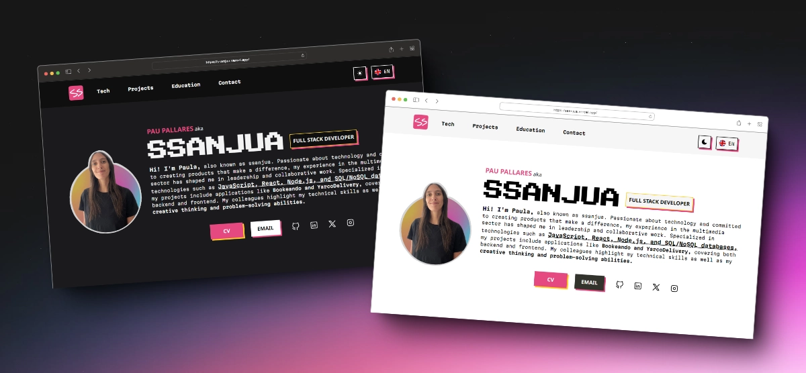

# MY PORTFOLIO 🌟

- Responsive: Built to be responsive across different devices 📲
- Dark/Light Mode: Toggle between dark and light color mode ⛅
- EN 🇺🇸 / ES 🇪🇸 : You can choose between spanish and english languages

### 🚀 technologies used

      

### 👀 Want to learn more?

    
